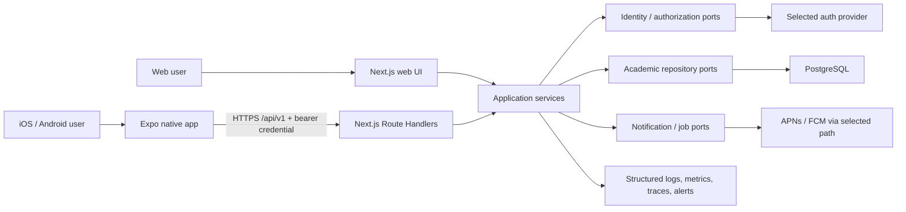

# Production multi-platform architecture

- **Architecture date:** 2026-08-08
- **Owner constraints approved:** 2026-08-09 — Nasser Al-Tamimi, D01–D16
- **Status:** **OWNER-APPROVED constraints with PROPOSED implementation blueprint; not current capability**
- **Current implementation evidence:** [repository and branch audit](../sprints/sprint-0m/repository-and-branch-audit.md)
- **Repository decision:** [production multi-platform repository strategy](../decisions/production-multiplatform-repository-strategy.md)

## Architecture boundary

**VERIFIED — current state:** StuPilot is a root-level Next.js 16.3 modular-monolith foundation with Arabic/RTL and English/LTR shells, PostgreSQL/Prisma infrastructure, production-shaped authentication and application-owned identity, and no academic product API, mobile app, accepted hosted provider, or deployment.

**PROPOSED — target state:** one server-authoritative StuPilot product serves a web client and native iOS/Android client through transport-independent application services. The web application and `/api/v1` remain one deployable Next.js backend for the MVP. The mobile application is an independently released Expo/React Native client. PostgreSQL is the system of record; client caches are replaceable projections.

**NOT VERIFIED:** provider selection, hosting/database vendors and regions, scale, final legal/retention policy, store accounts, production service levels, and device support. Saudi Arabia and 18+ are owner-approved launch direction, not proof of legal/store readiness.

## System context



- **PROPOSED** — browser and native sessions differ at the edge, but resolve to the same internal user ID and authorization policy.
- **PROPOSED** — no client connects directly to PostgreSQL or trusts provider profile data as authorization.
- **PROPOSED** — external provider, storage, notification, and observability SDKs stay in infrastructure adapters.
- **PROPOSED** — the historical research prototype remains outside every production dependency graph.

## Component and dependency model

| Layer               | Responsibility                                                                             | Allowed dependencies                                                                              |
| ------------------- | ------------------------------------------------------------------------------------------ | ------------------------------------------------------------------------------------------------- |
| Route composition   | Next.js pages/layouts, Route Handlers, web Server Actions, error/loading boundaries        | Presentation/transport composition and application entry points; no direct Prisma/provider calls. |
| Web presentation    | DOM UI, form state, web navigation, web accessibility, browser-only interaction            | Application-safe view models and web adapters; no database/provider SDK.                          |
| Native presentation | React Native screens, Expo Router, device permissions, native accessibility, app lifecycle | API client, contract types, native adapters, semantic tokens; no Next.js/Prisma imports.          |
| Transport adapters  | `/api/v1` parsing, auth context, validation, error serialization, web Action mapping       | Application services and versioned contract schemas.                                              |
| Application         | Use-case orchestration, ownership checks, transaction intent, provider/repository ports    | Domain and pure shared utilities only.                                                            |
| Domain              | Identity and academic invariants, value objects, policy decisions                          | No framework, transport, database, UI, or provider dependency.                                    |
| Infrastructure      | Prisma repositories, auth/provider adapters, notification adapter, telemetry exporters     | Application-owned ports plus vendor libraries.                                                    |

**PROPOSED — dependency rule:** every delivery mechanism terminates at the same application service. Route Handlers, Server Actions, scheduled workers, and future admin tools may translate input differently, but none may duplicate authorization or academic invariants.

## Web, API, and Server Action boundaries

### Web reads

**PROPOSED** — Server Components call application queries directly on the server. They must not call the application's own `/api/v1` endpoint because that adds an HTTP boundary, complicates build behavior, and provides no security benefit.

### Web mutations

**PROPOSED** — Server Actions may serve progressive-enhancement web forms. Treat each Action as an untrusted public mutation: authenticate, authorize the resource, validate input, enforce rate/idempotency rules as applicable, and return safe errors. The Action calls an application command also used by the API.

### Native reads and mutations

**PROPOSED** — the native client uses HTTPS `/api/v1` Route Handlers exclusively for StuPilot server data. It never imports a Server Action, database type, provider server client, or server environment variable.

### Public API controls

**PROPOSED** — every protected Route Handler applies, in order:

1. request ID and safe structured context;
2. method, content-type, body-size, and schema validation;
3. credential verification and internal identity resolution;
4. rate/abuse controls appropriate to the route;
5. application-service authorization and execution;
6. response schema validation for critical contracts;
7. safe error serialization, cache policy, and audit event where required.

Proxy can perform an optimistic redirect or coarse rejection, but **PROPOSED — authorization is repeated at the data access boundary**. A route/path check is never sufficient proof of object ownership.

## `/api/v1` contract

### Initial surface

The exact URL set is approved with the first vertical slice. A minimal candidate is:

| Route family                                                    | Purpose                                                                                                             | Status                                    |
| --------------------------------------------------------------- | ------------------------------------------------------------------------------------------------------------------- | ----------------------------------------- |
| `GET /api/v1/session`                                           | Return the internal user context, supported locale/time-zone settings, and capability flags after token validation. | **PROPOSED**                              |
| `/api/v1/terms`                                                 | Read/create/update the signed-in user's academic terms.                                                             | **PROPOSED**                              |
| `/api/v1/courses`                                               | Read/create/update courses scoped to an owned term.                                                                 | **PROPOSED**                              |
| `/api/v1/academic-items`                                        | Read/create/update/complete assignments, projects, exams, or other approved item kinds.                             | **PROPOSED**                              |
| `GET /api/v1/agenda`                                            | Query Today/This Week projections using explicit time-zone/week boundaries.                                         | **PROPOSED**                              |
| `/api/v1/devices`                                               | Register/revoke a push installation after notification scope is approved.                                           | **DEFERRED / PROPOSED**                   |
| `/api/v1/account/export` and `/api/v1/account/deletion-request` | Data access/deletion lifecycle used by web, native, and required public web deletion path.                          | **BLOCKED** by retention/legal decisions. |

**PROPOSED** — authentication initiation/callback endpoints depend on the selected provider and are designed separately. Never infer that email/password must traverse StuPilot APIs.

### Media type and schema

- **PROPOSED** — use JSON over HTTPS with UTF-8 and explicit ISO 8601 representations.
- **PROPOSED** — publish an OpenAPI description or equivalent machine-readable artifact generated from, or checked against, framework-neutral runtime schemas.
- **PROPOSED** — the contract package contains only serialized shapes, stable enums/codes, and fixtures. It cannot export Prisma records, `Date` objects, provider sessions, React components, or server-only code.
- **PROPOSED** — accept unknown additive response fields in clients; reject unknown request fields where ambiguity or privilege escalation is possible.
- **PROPOSED** — numeric values with precision requirements use a documented string/integer representation, never an accidental JavaScript float contract.

### Error envelope

**PROPOSED** — use an RFC 9457-style `application/problem+json` envelope with stable StuPilot codes:

```json
{
  "type": "https://stupilot.com/problems/validation",
  "title": "Request validation failed",
  "status": 422,
  "code": "VALIDATION_FAILED",
  "requestId": "opaque-request-id",
  "errors": [{ "path": "dueAt", "code": "INVALID_INSTANT" }]
}
```

The `stupilot.com` problem-type namespace above is a proposed contract example, not evidence that DNS, hosting, or the domain is live.

- **PROPOSED** — `code` and field error codes are stable client inputs; localized human copy remains client-owned.
- **PROPOSED** — `detail` is safe and optional; stack traces, SQL/provider messages, email existence, tokens, and internal IDs are never returned.
- **PROPOSED** — distinguish authentication (`401`), authorization/resource concealment (`403` or policy-approved `404`), validation (`400/422`), conflict (`409`), rate limit (`429`), and transient server failure (`5xx`).
- **PROPOSED** — include `Retry-After` only when the server can make a meaningful statement.

### Pagination, filtering, and caching

- **PROPOSED** — use opaque cursor pagination for collections whose order changes. Define a stable sort tuple such as `(updated_at, id)` and sign/validate cursor contents server-side.
- **PROPOSED** — cap page size and filter complexity; do not expose arbitrary ORM filtering.
- **PROPOSED** — use `ETag`/conditional GET for suitable user-scoped projections only after cache headers prove that shared caches cannot mix users.
- **PROPOSED** — protected responses default to `Cache-Control: private, no-store` until endpoint-specific review permits otherwise.

### Idempotency and concurrency

- **PROPOSED** — accept an `Idempotency-Key` for retry-prone creates/side effects. Bind it to internal user, route, and a request hash; return the original result for an approved retention window.
- **PROPOSED** — use a resource `version` or `updatedAt` precondition for edits. A stale write returns `409` with a fresh server representation or a refetch instruction.
- **PROPOSED** — database uniqueness is the final defense for identity links and natural invariants. Transactions that can conflict use the minimum sufficient isolation and bounded retry on specifically classified transient failures.
- **PROPOSED** — never translate every database unique error into “identity already exists”; classify the violated constraint.

### Versioning and compatibility

- **PROPOSED** — `/api/v1` is the major compatibility boundary. Additive optional fields and endpoints remain in v1; breaking meaning, required fields, or removals require a new major path or an explicit compatibility adapter.
- **OWNER-APPROVED** — support the current and immediately previous generally available native app versions with a minimum compatibility floor of 90 days, except a documented security/data-integrity emergency authorized by the owner.
- **PROPOSED** — advertise minimum-supported client policy through a non-sensitive capability response; do not force-upgrade unless a security or data-integrity issue requires it.
- **PROPOSED** — record deprecation and sunset dates, measure active versions, and remove behavior only after the support window and store rollout evidence permit it.
- **PROPOSED** — contract tests replay fixtures from every supported client version against the candidate backend.

## Authentication and internal identity

### Identity model

```text
users.id (StuPilot UUID)
    1
    |
    * auth_identities(provider_key, provider_subject)
```

- **OWNER-APPROVED** — `users.id` is a server-generated internal UUID and the only identity used as owner/actor in academic tables and audit events.
- **OWNER-APPROVED** — authentication identities use an opaque provider key and provider subject; the persistence design must enforce their uniqueness and relation to `users.id`.
- **OWNER-APPROVED** — `provider_key` is opaque, not a database enum of vendor names. This avoids a schema migration merely to add or replace a provider.
- **PROPOSED** — provider subject, issuer, and validation context are normalized only as required by the selected provider/protocol. Raw access/refresh tokens are not stored in application tables.
- **OWNER-APPROVED** — email is profile/contact evidence, not the durable identity join key; accounts are never automatically merged by email. Email/password registration requires verified email.
- **OWNER-APPROVED** — MVP exposes no general multi-provider linking; active, disabled, and deletion-pending states are required, and disabled/deletion-pending access fails closed.
- **PROPOSED / BLOCKED** — a 30-day deletion-cancellation grace remains subject to final privacy/legal policy. Duplicate-account remediation, administrative recovery, final deletion execution, and any future linking ceremony require security/privacy design.

### Browser session

- **PROPOSED** — use a server-issued/provider-supported secure cookie with `HttpOnly`, `Secure`, appropriate `SameSite`, narrow path/domain, expiry, and rotation.
- **PROPOSED** — validate the session at protected data access, not only proxy. Apply CSRF defenses to cookie-authenticated mutations and origin checks where appropriate.
- **PROPOSED** — do not expose refresh credentials to browser JavaScript.

### Native session

- **PROPOSED** — use the system browser and Authorization Code + PKCE for OAuth/OIDC-style flows when supported; do not embed provider sign-in in a WebView.
- **PROPOSED** — the native client sends an access credential as `Authorization: Bearer ...` to `/api/v1`. The API validates signature or trusted-provider evidence, issuer, audience, expiry, and required assurance before mapping `(provider_key, subject)` to `users.id`.
- **PROPOSED** — keep only the minimum renewable session credential in OS-protected storage. Expo SecureStore is a candidate adapter; it is not a source of truth and must handle uninstall, restore, biometric invalidation, and read/write failures.
- **PROPOSED** — cache no password and place no session credential in AsyncStorage, application logs, analytics, crash payloads, URLs, or notification data.
- **PROPOSED** — on logout/revocation, clear local credentials and server/provider session state according to selected semantics; treat offline logout as pending until server revocation succeeds or credential expiry makes it safe.

### Identity resolution and race behavior

1. **PROPOSED** — validate provider evidence and obtain a trustworthy provider subject.
2. **PROPOSED** — find the identity link by provider key + subject inside a bounded application transaction.
3. **PROPOSED** — if absent and account creation is allowed, create the internal user and identity link.
4. **PROPOSED** — if a narrowly identified unique conflict occurs, reread the winning link; do not create a second user.
5. **PROPOSED** — test the race against real PostgreSQL with concurrent connections and prove rollback leaves no orphan user.
6. **PROPOSED** — attach the resolved internal ID to request context; authorization uses only that ID.

## Authorization model

- **PROPOSED** — default deny. Every academic query/mutation scopes by internal owner ID or an explicit membership relation.
- **PROPOSED** — object ownership is checked in the application/repository operation that reads or writes the object, reducing time-of-check/time-of-use gaps.
- **PROPOSED** — client-supplied owner IDs are ignored; ownership derives from authenticated context.
- **PROPOSED** — elevated/admin capability, if introduced, uses separate roles, auditable actions, short-lived access, and no “magic email” rule.
- **PROPOSED** — existence concealment policy is consistent across web and API to avoid cross-account enumeration.

## Academic data model and lifecycle

### Initial aggregate boundaries

- **PROPOSED** — a user owns terms; a course belongs to one owned term; an academic item belongs to the user and optionally to a course/term according to approved product rules.
- **PROPOSED** — Today/This Week is a query projection, not a second writable copy of academic items.
- **PROPOSED** — reminders refer to an academic item and are scheduled by the backend; device installations are delivery targets, not reminder owners.
- **PROPOSED** — UUIDs are opaque public identifiers. Database keys and foreign keys enforce ownership structure; application policy enforces permissible transitions.

### Time semantics

- **PROPOSED** — all-day academic dates use PostgreSQL `date` and serialize as `YYYY-MM-DD`; they must not be converted through midnight UTC.
- **PROPOSED** — actual instants use `timestamptz`, are normalized by PostgreSQL, and serialize with an explicit offset/UTC.
- **PROPOSED** — store an IANA zone such as `Asia/Riyadh` separately when the original civil-time rule matters, because a `timestamptz` value does not retain the named zone.
- **PROPOSED** — recurring class meetings store local day/time plus IANA zone and recurrence rules; generated occurrences are derived with explicit daylight-saving policy.
- **OWNER-APPROVED** — Sunday is the default week start, `Asia/Riyadh` is the onboarding default, and users can select a valid IANA zone before broad launch. **BLOCKED** — travel/change and recurrence-ambiguity behavior still need contract design and tests.
- **PROPOSED** — server responses include the effective zone and week boundary used so web/native cannot silently disagree.

### Lifecycle and deletion

- **PROPOSED** — routine user deletion of academic records uses hard deletion unless audit/legal requirements justify a tombstone; do not accumulate indefinite soft-deleted personal data by default.
- **PROPOSED** — account deletion is an explicit state machine: request, reauthentication/confirmation, grace or immediate-lock policy, provider revocation, owned-data deletion/anonymization, completion receipt, and backup-expiry disclosure.
- **PROPOSED** — retention differs by data class: account/profile, academic content, security audit, operational logs, idempotency records, and backups each need an owner-approved period and deletion behavior.
- **BLOCKED** — no production identity migration or store submission proceeds until privacy notice, export scope, deletion path, retention schedule, and responsible owner are approved.

### Migrations

- **PROPOSED** — create migrations in development, review generated SQL, test forward application and recovery, and apply committed history with `prisma migrate deploy` in controlled CI/CD.
- **PROPOSED** — never use `prisma db push` in staging/production and never edit a migration already applied in a shared environment.
- **PROPOSED** — use expand/contract for changes visible to installed clients: add nullable/backfilled representation, deploy dual-compatible server, migrate data, update clients, observe support window, then remove old representation in a later migration.
- **PROPOSED** — large backfills are resumable, measured, and separated from blocking schema changes.
- **PROPOSED** — destructive migration approval includes affected-row estimate, lock analysis, backup/PITR evidence, rollback/roll-forward plan, and application compatibility matrix.

### Backup and restore

- **PROPOSED** — select a managed PostgreSQL capability with encrypted backups and point-in-time recovery appropriate to approved RPO/RTO.
- **OWNER-APPROVED planning target** — RPO at most 15 minutes and RTO at most 4 hours. **NOT VERIFIED** — provider capability, cost, configuration, and restore performance remain unproved.
- **PROPOSED** — run an automated backup policy plus a restore into an isolated environment at least monthly, and a documented recovery exercise before public launch and quarterly thereafter.
- **PROPOSED** — a backup success signal is insufficient; record restoration duration, data-integrity checks, migration compatibility, access control, and deletion/retention behavior.
- **NOT VERIFIED** — no provider, backup, PITR, restore, or achieved operational RPO/RTO evidence exists today.

## Mobile application architecture

### Framework and version policy

- **PROPOSED** — use Expo with React Native and Expo Router unless a pre-implementation proof identifies a required native capability it cannot support safely.
- **VERIFIED, point-in-time research** — on 2026-08-08 Expo's latest SDK table lists SDK 57 with React Native 0.86, React 19.2.3, and minimum Node 22.13.x. This is compatibility evidence, not a selected version.
- **PROPOSED** — at the mobile foundation gate, select the latest stable Expo SDK supported by required libraries, current store toolchains, the repository's supported Node line, and device tests. Record exact versions in a new decision and lockfile then.
- **PROPOSED** — use development builds, not Expo Go, for auth callbacks, secure storage, notifications, signing-sensitive capabilities, and realistic device testing.

### Native module boundaries

```text
Expo Router screens
  -> feature view models/hooks
    -> typed API client + cache policy
      -> /api/v1 contracts

Native adapters
  -> secure credential storage
  -> linking
  -> notifications
  -> app lifecycle/network state
```

- **PROPOSED** — navigation routes do not contain domain/business rules.
- **PROPOSED** — the API client owns base URL, credential attachment, timeout, retry, request ID, parsing, and problem-code mapping.
- **PROPOSED** — retry only safe/idempotent operations and use jitter/bounds; never replay a non-idempotent mutation without its idempotency key.
- **PROPOSED** — platform adapters are injectable so unit tests do not require device APIs.

### Cache and offline behavior

- **OWNER-APPROVED — MVP is online-first with resilient reads, not offline-first.** Server data is authoritative; the first native slice may retain a bounded, user-scoped read cache and recoverable form input for launch/network interruption.
- **PROPOSED** — on sign-out or identity change, clear every user-scoped cache before another account can render.
- **PROPOSED** — store only the minimum session credential in secure storage. Academic caches use a separately reviewed persistence mechanism, data minimization, expiry, and device-threat decision if persistent storage is enabled.
- **PROPOSED** — show last-updated/stale state and preserve user input on recoverable failure.
- **OWNER-APPROVED** — the initial MVP has no general offline mutation queue, silent last-write-wins behavior, or local academic database. Any future offline editing requires a separate owner and architecture decision.

### Deep links and auth callbacks

- **PROPOSED** — prefer HTTPS iOS Universal Links and Android App Links backed by domain association files. Keep a custom scheme only where a provider or development flow requires it.
- **PROPOSED** — callbacks use exact allowlists, short-lived single-use state, PKCE where applicable, nonce/replay defenses, and a safe web fallback when the app is not installed.
- **PROPOSED** — no access/refresh token appears in a query string, log, analytics event, or error report.
- **PROPOSED** — test cold start, background, already-running, app-not-installed, expired link, replay, wrong environment, and Arabic/English destinations in signed development and release-like builds.

### Notifications and background work

- **PROPOSED** — the backend owns reminder timing and sends push attempts; device background execution is never the clock of record.
- **PROPOSED** — notification payloads are minimal and non-sensitive (opaque item reference plus category); the authenticated app fetches current content.
- **PROPOSED** — installations are user/device/environment scoped, revocable, deduplicated, and disabled after provider “not registered” feedback.
- **PROPOSED** — record enqueue, provider acceptance/receipt, and invalid-token evidence without claiming device display. Push delivery is best effort.
- **PROPOSED** — background tasks are only for deferrable sync/prefetch. They cannot promise exact reminder execution and may stop when the user kills the app or system constraints intervene.
- **BLOCKED** — push provider path, permission copy, reminder scope, quiet hours, locale/time-zone behavior, and data disclosure require owner decisions and real-device proof.

## Cross-platform design system

### Token architecture

- **VERIFIED** — current web CSS has useful primitive and semantic beginnings, but no approved cross-platform token source.
- **PROPOSED** — define platform-neutral primitives and semantic aliases in reviewed data/TypeScript: colors, spacing, radius, typography roles, elevation intent, focus, and motion durations.
- **PROPOSED** — generate or map those values into web CSS custom properties and a React Native theme object. Keep platform exceptions explicit rather than forcing false pixel identity.
- **PROPOSED** — no shared UI-component package for the MVP. Web and native components share names/intent and acceptance criteria, not DOM/native implementations.
- **OWNER-APPROVED** — support light, dark, and system appearance. Theme variants must meet contrast requirements; exact brand fonts, logo, and final visual tokens remain a dedicated design decision.

### Localization and RTL

- **PROPOSED** — keep Arabic first-class and English equal in every contract, test fixture, screenshot plan, and store listing.
- **PROPOSED** — share stable locale/message keys only where wording is truly identical; use platform-specific messages for permissions, navigation, and accessibility.
- **PROPOSED** — web uses document `lang`/`dir`, logical CSS, and bidi isolation. Native uses platform direction APIs, start/end layout properties, mirrored directional icons where semantically required, and a tested restart strategy if direction change needs one.
- **PROPOSED** — identifiers, dates, times, and mixed Arabic/Latin content receive explicit bidi handling on both platforms.
- **PROPOSED** — no string concatenation for translated sentences; use parameterized messages and locale-aware formatting.

### Accessibility parity

- **PROPOSED** — both platforms target WCAG 2.2 AA intent while respecting native Apple/Android accessibility conventions.
- **PROPOSED** — preserve at least 44x44 CSS-pixel/point interactive targets, visible focus where applicable, meaningful labels/roles/states, reduced motion, scalable text, contrast, logical reading order, and non-color error cues.
- **PROPOSED** — automated checks are necessary but insufficient. Release evidence includes keyboard/zoom/high-contrast/screen-reader web passes and VoiceOver/TalkBack, Dynamic Type/font scale, orientation, reduced motion, and RTL device passes.

## Environments, builds, and releases

### Environment model

| Environment | Purpose                                                | Rules                                                                                                                                           |
| ----------- | ------------------------------------------------------ | ----------------------------------------------------------------------------------------------------------------------------------------------- |
| Local/test  | Deterministic development and automated tests          | **VERIFIED** — local env separation exists. **PROPOSED** — continue fake/local credentials and isolated databases.                              |
| Staging     | Real provider/database, contract and device validation | **BLOCKED** — not created. Must use separate auth project, DB, API origin, deep-link domain, signing variant, push credentials, and test users. |
| Production  | Real users and store clients                           | **BLOCKED** — requires owner approval, secrets, operations, privacy, backups, monitoring, and store gates.                                      |

- **PROPOSED** — web server secrets stay in the host secret manager; only intentionally public values use `NEXT_PUBLIC_`.
- **PROPOSED** — mobile build-time public configuration is not secret. Any value shipped in the binary must be safe to disclose.
- **PROPOSED** — development/preview/production mobile variants use distinct bundle/application IDs or a documented safe strategy so test links, pushes, and data cannot cross environments.
- **PROPOSED** — production migrations run as a single controlled release step before compatible server deployment, never from every application instance.

### Native build and signing

- **OWNER-APPROVED direction** — evaluate EAS Build as the initial candidate for reproducible signed development/preview/store artifacts. The managed-versus-customer credential custody model remains **BLOCKED** on a later security decision.
- **VERIFIED** — store artifacts must be signed. iOS distribution uses Apple account certificates/profiles; Android can use Play App Signing with a separate upload key.
- **PROPOSED** — organization-owned accounts, MFA, least-privilege roles, recovery contacts, key inventory, rotation/revocation runbooks, and no credentials in Git are release prerequisites.
- **PROPOSED** — use internal/TestFlight/internal or closed testing before public rollout, then staged/phased release with crash/API/error monitoring and a stop rule.
- **PROPOSED** — remote update capability, if adopted, receives its own policy for runtime-version compatibility, rollback, review compliance, signing, and emergency disablement. It is not assumed here.

### Store and privacy readiness

- **VERIFIED, time-sensitive** — Google states that starting 2026-08-31 new apps and updates must target Android 16/API 36 or higher, subject to documented form-factor exceptions. Recheck at every release.
- **VERIFIED, time-sensitive** — Google requires Data safety declarations for closed, open, and production tracks (internal-only testing is exempt) and includes third-party SDK behavior. Apps with in-app account creation require an in-app deletion path and a public web deletion-request resource.
- **VERIFIED, time-sensitive** — Apple requires a privacy policy URL and App Privacy disclosures including integrated third parties; App Review rules require in-app account deletion when account creation is supported.
- **PROPOSED** — maintain a data inventory generated from actual client/server behavior and SDK review. Store declarations, privacy notice, permissions, retention, and deletion must change together.
- **PROPOSED** — recheck current Xcode/SDK, target API, privacy manifest, age rating, export compliance, tester, screenshot, and review-account requirements at the implementation and submission gates. This document does not freeze mutable store policy.

## Observability and operations

- **PROPOSED** — use structured events with request ID, environment, release, route/use case, duration, outcome code, and opaque internal actor correlation; redact credentials, cookies, provider payloads, emails, academic free text, and notification contents.
- **PROPOSED** — mobile reports release/runtime version, platform, route category, connectivity, and safe problem code; server traces correlate through a client-generated request ID accepted under validation.
- **PROPOSED** — initial service indicators: API availability/latency/error rate, auth success/failure by safe reason, database pool/latency, migration state, notification handoff/invalid tokens, crash-free sessions, and supported client-version usage.
- **PROPOSED** — alerts have an owner, threshold, runbook, and test. Logs without response ownership are not production readiness.
- **PROPOSED** — define incident severity, credential-revocation, provider outage, database restore, bad migration, API rollback, and forced-client-upgrade runbooks before launch.
- **NOT VERIFIED** — no telemetry backend, alert channel, on-call owner, SLO, or production runbook is currently operational.

## Verification matrix

| Gate                | Required proof                                                                                                                                                                                                             |
| ------------------- | -------------------------------------------------------------------------------------------------------------------------------------------------------------------------------------------------------------------------- |
| Static architecture | **PROPOSED** — format, lint, strict typecheck, dependency boundaries for every workspace, no prototype/provider/Prisma leakage into clients/contracts.                                                                     |
| Domain/application  | **PROPOSED** — unit and property/boundary tests for ownership, time boundaries, lifecycle, idempotency, and error mapping.                                                                                                 |
| Database            | **PROPOSED** — real PostgreSQL migrations, rollback/roll-forward drill, concurrent identity/item updates, transaction retry limits, cascade/deletion, backup restore.                                                      |
| API                 | **PROPOSED** — schema/fixture compatibility, authentication/authorization negatives, pagination stability, idempotent retries, stale update, rate/body limits, safe errors, previous client versions.                      |
| Provider            | **PROPOSED** — real staging registration/sign-in/verification/refresh/expiry/logout/revocation/recovery, callback replay, outage, rate limits, email privacy, and browser/native differences.                              |
| Web                 | **PROPOSED** — existing suites plus authenticated journeys, browser matrix, CSRF, route/data guards, Arabic/English/RTL, accessibility manual checks.                                                                      |
| Native              | **PROPOSED** — unit/component plus signed-build tests on supported iOS/Android devices for session persistence, cache clearing, network loss, lifecycle, deep links, push, RTL, font scaling, VoiceOver/TalkBack, upgrade. |
| Release             | **PROPOSED** — reproducible artifacts, SBOM/audit/secret scan, store validation, privacy inventory, signing custody, staged rollback, monitoring, restore evidence.                                                        |

## Security and privacy invariants

1. **PROPOSED** — authenticate and authorize on every protected server operation; the client is never a policy authority.
2. **PROPOSED** — internal user IDs own data; provider identities authenticate but do not define domain ownership.
3. **PROPOSED** — collect the minimum data; document purpose, access, retention, export, and deletion for each class.
4. **PROPOSED** — secrets exist only in approved secret stores or OS credential storage and never in repository, binary-visible config, logs, analytics, URLs, notifications, screenshots, or fixtures.
5. **PROPOSED** — validate every external input and output contract; use safe stable error codes.
6. **PROPOSED** — rate-limit and abuse-protect auth, recovery, write, export, deletion, and notification-registration paths.
7. **PROPOSED** — dependency/provider adoption includes data-flow, maintenance, vulnerability, license, outage, exit, and store-disclosure review.
8. **PROPOSED** — installed clients may lag; database and API deployments remain backward-compatible through the support window.

## Primary-source research record

All entries were accessed on 2026-08-08. Store/framework requirements are time-sensitive and must be rechecked at their implementation gate.

| Source                                                                                                                                                                                          | Exact claim used                                                                                                                                                                                         | Uncertainty / version note                                                                                   |
| ----------------------------------------------------------------------------------------------------------------------------------------------------------------------------------------------- | -------------------------------------------------------------------------------------------------------------------------------------------------------------------------------------------------------- | ------------------------------------------------------------------------------------------------------------ |
| [Installed Next.js 16.3 project, Route Handler, Server Action, authentication, data security, environment, production, and deployment guides](../../node_modules/next/dist/docs/)               | **VERIFIED** — current repository framework conventions and security/deployment guidance were read before authoring.                                                                                     | Local installed documentation governs this repository version; online docs can move.                         |
| [Next.js Backend for Frontend](https://nextjs.org/docs/app/guides/backend-for-frontend)                                                                                                         | **VERIFIED** — Route Handlers are public endpoints; validate/auth/rate-limit them; Server Components should read sources directly; Server Actions are frontend mutations and queued.                     | Backend limits vary by deployment host.                                                                      |
| [npm 11 workspaces](https://docs.npmjs.com/cli/v11/using-npm/workspaces/)                                                                                                                       | **VERIFIED** — one root can manage local packages, auto-link them, and run commands per/all workspaces.                                                                                                  | Page showed npm 11.19.0; repository npm policy must be revalidated at transition.                            |
| [Expo SDK versions](https://docs.expo.dev/versions/latest/)                                                                                                                                     | **VERIFIED** — latest table showed SDK 57 / RN 0.86 / React 19.2.3 / minimum Node 22.13.x.                                                                                                               | Point-in-time compatibility only; no version selected.                                                       |
| [React Native releases](https://reactnative.dev/releases/overview)                                                                                                                              | **VERIFIED** — official release status is available for supported/stable selection.                                                                                                                      | Recheck when the mobile app is created; do not select a future/pre-release line here.                        |
| [Expo linking overview](https://docs.expo.dev/linking/overview/)                                                                                                                                | **VERIFIED** — Universal Links/App Links use verified web domains; Expo Router enables route linking; development builds are recommended for realistic testing.                                          | Domain, routes, and auth-provider callback rules remain undecided.                                           |
| [Expo SecureStore](https://docs.expo.dev/versions/latest/sdk/securestore/)                                                                                                                      | **VERIFIED** — encrypted Android Keystore-backed preferences/iOS Keychain storage; Android uninstall loss, possible iOS persistence, biometric invalidation, and “not sole source of truth” limitations. | Candidate adapter only; threat model and exact options need device tests.                                    |
| [Expo BackgroundTask](https://docs.expo.dev/versions/latest/sdk/background-task/)                                                                                                               | **VERIFIED** — work is deferrable/system-controlled and can stop when the app is killed; execution time is not exact.                                                                                    | Documentation behavior varies by OS/vendor; real devices required.                                           |
| [Expo notification behavior](https://docs.expo.dev/push-notifications/what-you-need-to-know/) and [delivery FAQ](https://docs.expo.dev/push-notifications/faq/)                                 | **VERIFIED** — push needs a development build; OS/background delivery is not guaranteed; invalid installations must be handled.                                                                          | Expo Push Service versus direct APNs/FCM is not selected.                                                    |
| [Expo app credentials](https://docs.expo.dev/app-signing/app-credentials/)                                                                                                                      | **VERIFIED** — store builds must be signed; EAS can manage or accept credentials; iOS and Android require different credential sets.                                                                     | Custody model, accounts, identifiers, and EAS adoption are owner decisions.                                  |
| [Google Play target API](https://developer.android.com/google/play/requirements/target-sdk)                                                                                                     | **VERIFIED** — from 2026-08-31 new apps/updates generally must target Android 16/API 36+.                                                                                                                | Time-sensitive; exceptions and future dates must be rechecked at submission.                                 |
| [Google Play Data safety](https://support.google.com/googleplay/android-developer/answer/10787469?hl=en)                                                                                        | **VERIFIED** — declarations include third-party SDK behavior; closed/open/production tracks require the form, while internal-only testing is exempt.                                                     | Actual answers depend on the final binary and services.                                                      |
| [Google Play account deletion](https://support.google.com/googleplay/android-developer/answer/13327111?hl=en-EN)                                                                                | **VERIFIED** — apps enabling account creation need in-app and public-web account deletion request paths.                                                                                                 | Legal retention exceptions and UX require counsel/owner review.                                              |
| [Android Play App Signing](https://developer.android.com/studio/publish/app-signing)                                                                                                            | **VERIFIED** — Play can hold the app-signing key while the developer uses a separate upload key.                                                                                                         | Cross-store signing and custody choices remain open.                                                         |
| [Apple App Privacy details](https://developer.apple.com/app-store/app-privacy-details/) and [App Review Guidelines](https://developer.apple.com/app-store/review/guidelines/)                   | **VERIFIED** — privacy policy/data-use disclosures include third parties; apps supporting account creation must provide in-app deletion.                                                                 | App behavior and Apple policy must be reviewed at submission.                                                |
| [PostgreSQL date/time types](https://www.postgresql.org/docs/current/datatype-datetime.html)                                                                                                    | **VERIFIED** — `date` is date-only; `timestamptz` stores an instant normalized internally and does not retain the original named zone.                                                                   | Current page is PostgreSQL 18; selected managed version remains open.                                        |
| [PostgreSQL backup and restore](https://www.postgresql.org/docs/current/backup.html)                                                                                                            | **VERIFIED** — PostgreSQL documents SQL dumps, file-system backup, and continuous archiving approaches.                                                                                                  | Actual PITR/RPO/RTO depend on the selected provider and tested operations.                                   |
| [Prisma Migrate commands](https://www.prisma.io/docs/cli/migrate) and [deployment guidance](https://www.prisma.io/docs/orm/prisma-client/deployment/deploy-migrations-from-a-local-environment) | **VERIFIED** — `migrate deploy` applies committed production migrations and automated CI/CD is recommended over local production execution.                                                              | Repository Prisma 7 behavior remains the implementation reference.                                           |
| [Prisma transactions](https://www.prisma.io/docs/orm/v6/prisma-client/queries/transactions)                                                                                                     | **VERIFIED** — serializable transactions can surface `P2034` conflicts/deadlocks and require retries.                                                                                                    | The cited page path is v6; verify Prisma 7 API/error behavior in installed docs/tests before implementation. |
