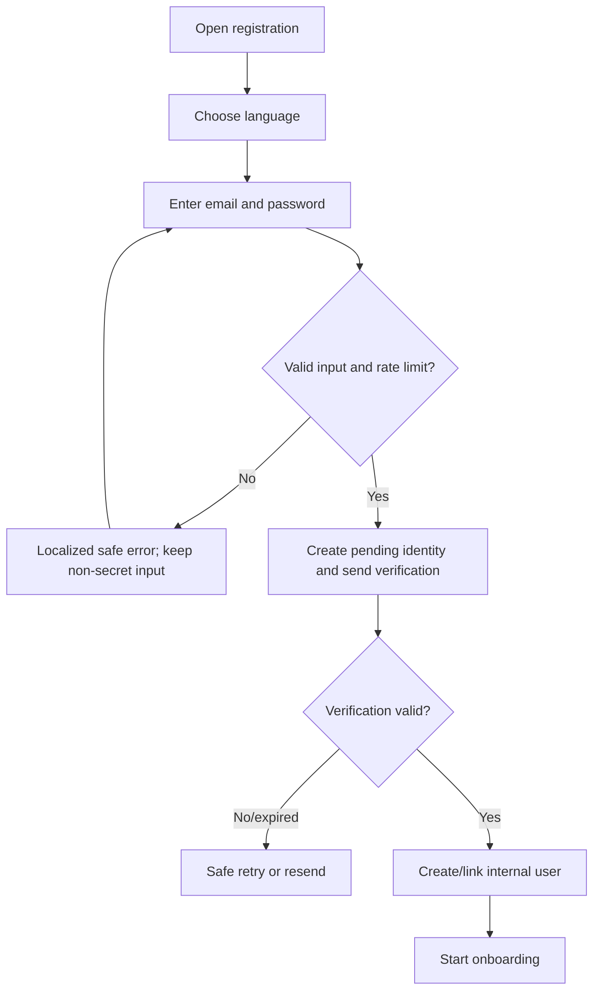
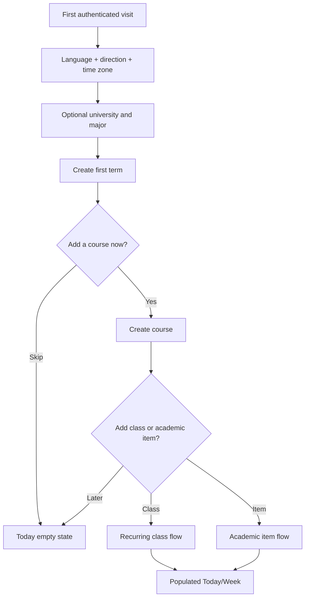
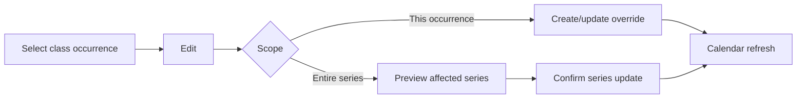

# StuPilot — Information Architecture and User Flows

**Deliverable:** 3C  
**Version:** 1.0  
**Date:** 5 August 2026  
**Status:** Production UX blueprint; no UI components created

## 1. Experience model

The primary object hierarchy is:

```text
Account
└── Academic term
    ├── Course enrollment
    │   ├── Recurring class series
    │   │   └── Occurrence override
    │   └── Academic items
    └── Uncategorized academic items
```

Today, This Week, and Calendar are projections of this owned data; they are not separate stores. Quick Capture is an entry point, not a content type.

## 2. Production sitemap

```text
Public
├── Landing / product information
├── Register
├── Verify email
├── Login
├── Forgot password
├── Reset password
├── Privacy / terms / support
└── Service status link

Authenticated
├── Onboarding
│   ├── Language and time zone
│   ├── Optional university and major
│   ├── First academic term
│   └── First course / skip to dashboard
├── Today
├── This Week
├── Calendar
├── Courses
│   ├── Course list
│   └── Course detail
│       ├── Schedule
│       └── Academic items
├── Terms
├── Academic item detail / edit
├── Class occurrence / series detail
├── Notification center
├── Quick Capture modal/sheet
└── Settings
    ├── Profile
    ├── Language and time zone
    ├── Notifications
    ├── Sessions and security
    └── Account deletion
```

## 3. Navigation

### Mobile

Bottom navigation contains four stable destinations:

1. Today.
2. This Week.
3. Calendar.
4. More.

Quick Capture is a persistent, clearly labelled primary action adjacent to or above the bottom navigation. `More` contains Courses, Terms, Notifications, and Settings. Deep screens use a visible Back action whose visual direction follows locale while browser history remains correct.

Mobile constraints:

- no capability depends on hover, drag, or a right-click;
- filters open in a bottom sheet and preserve the underlying scroll position;
- detail/edit may use full-screen sheets when space is constrained;
- calendar defaults to agenda when a month grid cannot remain accessible; month navigation remains available if approved for `1.0`.

### Desktop

A persistent sidebar contains Today, This Week, Calendar, Courses, and Settings. Term switcher and notification access are in the application header. Quick Capture remains prominent. Wider screens may use list/detail split panes, but every route has a canonical URL and works without the split pane.

### Direction rules

- Root navigation order is semantically consistent; visual order follows `dir`.
- Previous/next in time use localized meaning and accessible labels, not icon shape alone.
- CSS logical properties control inline/block spacing and alignment.
- Course codes, emails, times, and mixed text use bidi isolation where needed.

## 4. Global state model

Every authenticated route can render these states:

| State | Behavior |
|---|---|
| Loading | Skeleton reflects final layout; no fake data or layout shift. |
| Ready | Server-authorized data for active user and selected term. |
| Empty | Explains what is missing and gives one primary action. |
| Recoverable error | Retains safe input/filter state, shows Retry and correlation ID. |
| Unauthorized | Clears protected client cache and returns to login. |
| Forbidden/not found | One non-disclosing response. |
| Offline | No success claim; pending input is retained only on the current device where safe. |
| Conflict | Explain stale edit and offer refresh/reapply; never silently overwrite. |

## 5. Authentication flows

### Registration



Requirements: generic response for existing email, time-limited verification, no password in logs, safe resend throttling, and a visible path to login.

### Login and logout

Login validates server-side and sends the user to the safe intended route or Today. Errors do not distinguish unknown email from wrong password. Logout invalidates the intended session, clears protected caches, and returns to a public route.

### Password recovery

Request email → always show a generic confirmation → use one-time/expiring token → choose new password → revoke sessions according to policy → confirmation → login. Expired or reused links return to a safe new request.

## 6. Onboarding and first value



Onboarding is resumable. Optional fields are never disguised as required. Leaving onboarding preserves completed steps.

## 7. Term and course flows

### Create first or later term

Terms → Add term → name, start, end, time zone → validate → choose active status → save. If another term is active, explain that the new selection changes default views but does not delete the previous term.

### Add a course

Courses → Add course → choose term → name → optional code/color/location → save → course detail. Duplicate names are allowed with a warning; color is never the only identifier.

Archive flow: Course detail → Archive → explain that historical schedule/items remain → confirm → remove from default pickers. Restore reverses archival. Hard delete is limited by retention and referenced-data rules.

## 8. Recurring class flows

### Create series

Course detail or Calendar → Add class → weekdays → local start/end → date range (defaults to term) → time zone → optional location → preview first occurrences → save.

Validation includes end after start, at least one weekday, dates inside or explicitly beyond term, DST preview, and overlap warning.

### Edit one occurrence

Select occurrence → Edit → scope dialog → **This occurrence** → change time/location or cancel → preview original/new → save override → return to calendar with one updated occurrence.

### Edit entire series

Select occurrence/series → Edit → scope dialog → **Entire series** → edit pattern → show affected range/count → confirm → transactional save → re-render. The action never silently removes independent academic items.



## 9. Academic item and Quick Capture flows

### Full create

Add item → type (assignment/project/exam) → title → term/course → deadline/all-day → optional planned start/duration → optional reminder → review → save → detail.

### Quick Capture

Open Quick Capture → type + title + deadline or “schedule later” → optional course → Save. Advanced fields remain collapsed. Save confirmation offers Undo where safe and Edit.

### Error behavior

- Local validation focuses the first error and preserves all fields.
- A failed server save keeps the draft and never inserts an optimistic permanent item.
- Repeated submission uses an idempotency key.
- A stale course/term prompts reselection without discarding the title or dates.

## 10. Today and This Week

### Today ordering

1. Overdue open items.
2. Items due today.
3. Planned work today.
4. Class occurrences in time order.
5. Completed today, collapsed by default.

An item appearing in due and planned contexts is one object with two labelled time meanings. The UI may cross-reference it but must avoid presenting two independent completions.

### This Week

Header shows the exact date range and week-start convention. Users navigate by week, return to current week, filter by course/type, and distinguish deadline, planned work, and class time. Filters live in URL/search state when practical so refresh does not lose context.

### Empty states

- No active term: Create/select term.
- Active term but no data: Add course, class, or item.
- Genuine free day/week: calm “Nothing scheduled” state plus next upcoming item and Quick Capture.

## 11. Calendar flow

Calendar → choose month/agenda → navigate period → select event → detail. On mobile, agenda is the accessible fallback and may be default. Classes, deadlines, and planned blocks have shape/text labels in addition to color.

Creating from a date pre-fills that date but asks whether the entry is a class series or academic item. Drag-to-reschedule is optional later; the MVP always provides an explicit Edit form.

## 12. Completion, reopening, and rescheduling

### Complete/reopen

Item action → Complete → immediate state update after server success → Undo/reopen. Reopening does not create a new item and does not alter deadline or planned time.

### Reschedule planned work

Item detail → Reschedule planned work → choose date/time/duration → review screen displays:

- Deadline: unchanged.
- Previous plan.
- New plan.

Save changes only planned fields. A separate “Edit deadline” route requires its own explicit label and confirmation when moving a past/near deadline.

## 13. Reminder flow

Item detail → Add reminder → choose basis (deadline or planned time) → choose supported offset/absolute time → preview in user's time zone → save. Notification center lists due reminders and supports mark read. Disabled reminders remain inspectable on the item until deleted.

If the chosen basis later changes, the UI explains whether the reminder follows the basis or remains absolute. This behavior must be consistent with the database field, not inferred differently by clients.

## 14. Settings flows

### Locale and time zone

Settings → Language/time zone → preview direction/date format → save → reload server-rendered shell in selected locale. Changing time zone explains that stored instants are re-displayed while recurring classes preserve their series-local time zone.

### Profile

Optional university and major can be added, changed, or cleared. No university lookup or verification is required.

### Sessions and account

Where the auth provider supports it: list sessions → revoke one/all others. Account deletion requires recent authentication, consequence summary, grace/retention disclosure, typed or equivalent confirmation, and a final status message.

## 15. Responsive acceptance matrix

| Journey | Mobile | Desktop |
|---|---|---|
| Register/recovery | Single-column, keyboard-safe, no horizontal scroll | Centered constrained form |
| Onboarding | One decision per step | Same steps, optional contextual panel |
| Today/Week | Stacked sections and sheets | Multi-column/list-detail where helpful |
| Calendar | Agenda-first accessible path; month if usable | Month plus detail pane |
| Quick Capture | Bottom/full-screen sheet | Modal or side panel |
| Recurrence scope | Full-width confirmation with explicit buttons | Dialog with affected preview |
| Settings | Stacked routes | Settings sidebar + content |

## 16. UX handoff checklist

- Every route maps to `03a` requirement IDs.
- Arabic and English copy exists for labels, errors, empty states, emails, and notifications.
- Focus order and announcement behavior are documented.
- All wide-scope/destructive actions identify affected data.
- Every form has loading, validation, conflict, network failure, and success states.
- No flow asks for SIS/LMS credentials, real academic files, payment, or AI content.
- The research prototype is not used as the production design system or code source.
