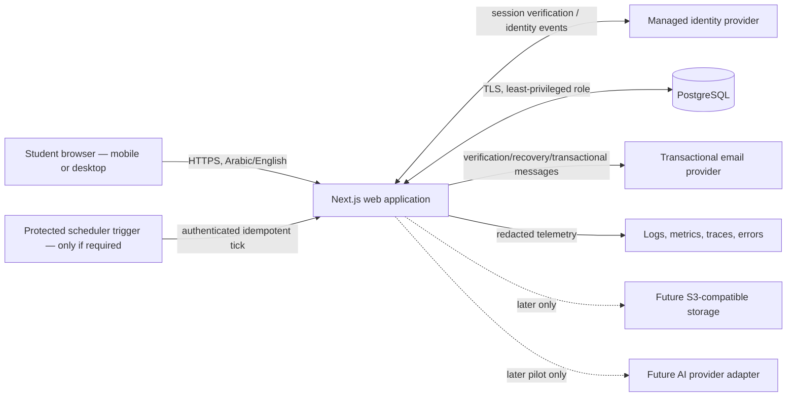
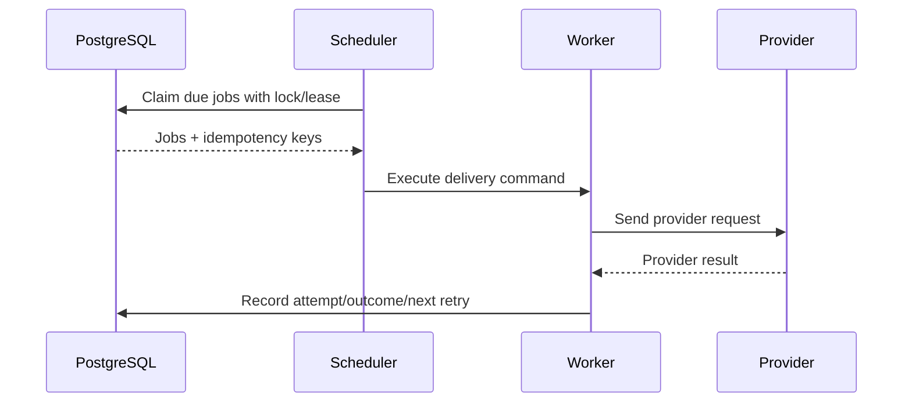

# StudentHub AI — System Architecture Blueprint

**Deliverable:** 3E  
**Version:** 1.0  
**Date:** 5 August 2026  
**Status:** Proposed production architecture; no infrastructure or code created

## 1. Architecture decision

Build the MVP as a **modular monolith** in one Next.js deployment with one PostgreSQL database. Keep UI, transport, application, domain, and persistence boundaries explicit inside the repository. Add external services only for authentication, transactional email, database hosting, and observability when the owner selects them.

This topology optimizes for a solo founder while retaining a clean `/api/v1` boundary for future mobile clients. It intentionally avoids microservices, event streaming, Redis, Kubernetes, a separate NestJS backend, an AI service, and object storage in the MVP.

## 2. Context diagram



## 3. Logical layers

| Layer | Responsibility | Must not do |
|---|---|---|
| Presentation | Routes, layouts, components, localized copy, form interaction, accessibility | Direct SQL, trust client ownership, import vendor secrets |
| Transport | Route Handlers, webhooks, request parsing, API versioning, response/error mapping | Contain domain rules or unscoped queries |
| Application | Use cases, transactions, authorization orchestration, idempotency | Render UI or return ORM records directly |
| Domain | Entities/value objects, invariants, recurrence and status rules | Depend on Next.js, auth vendor, email, or storage SDK |
| Persistence | Repositories, Prisma client, transactions, migrations, query tuning | Decide user permissions outside explicit scope |
| Adapters | Identity, email, clock, observability, future storage/jobs/AI | Leak provider-specific objects into domain modules |

Dependency direction is inward: presentation/transport → application → domain. Persistence and providers implement ports owned by the application.

## 4. Production module boundaries

```text
identity
profile-settings
academic-terms
courses
class-schedules
academic-items
planning-views
calendar
reminders-notifications
audit-security
shared-i18n-time
```

Each module owns its validation schemas, application commands/queries, repository interface, and tests. Cross-module access occurs through exported application services, not imports from another module's database implementation.

## 5. Frontend boundary

- Next.js App Router owns route composition, server rendering, localized metadata, loading/error boundaries, and web forms.
- Server Components read through application query services. They do not fetch the application's own Route Handlers.
- Client Components are limited to interaction requiring local state/browser APIs: Quick Capture sheet, calendar interactions, optimistic affordances, filters, recurrence scope dialog.
- Protected data is not embedded in public caches or static output.
- Client state is not the source of truth; successful server mutation returns canonical state or triggers safe revalidation.
- Locale is resolved before protected shell render; root `lang` and `dir` are correct on the first response.
- A feature directory cannot bypass application authorization by importing the ORM client.

## 6. Backend and API boundary

The same deployment exposes:

1. Server-side application calls for web-rendered pages and server mutations.
2. Versioned JSON endpoints under `/api/v1` for interactive clients and future mobile use.
3. Narrow webhook endpoints for selected providers.
4. A protected idempotent scheduler endpoint only if reminder materialization requires it.

### API rules

- HTTPS only in production.
- JSON UTF-8; ISO 8601 instants; IANA time-zone IDs; locale-neutral enum values.
- Validate body, path, query, and provider webhook signature at the boundary.
- Authenticate first, derive internal user ID, then call an owner-scoped application use case.
- Use opaque cursor pagination if any list grows beyond bounded term views.
- Standard errors: `code`, localized-safe `message`, `fieldErrors` when applicable, `correlationId`; no stack trace.
- `404` may be used for missing or non-owned resources to avoid disclosure.
- Mutating create operations accept an idempotency key where duplicate retries are plausible.
- Concurrency-sensitive updates use a version/updated-at precondition and return `409` on stale state.
- Do not expose ORM models or auth-provider tokens.

### Proposed route families

```text
/api/v1/me
/api/v1/terms
/api/v1/courses
/api/v1/class-series
/api/v1/class-series/{id}/overrides
/api/v1/academic-items
/api/v1/views/today
/api/v1/views/week
/api/v1/calendar
/api/v1/reminders
/api/v1/notifications
/api/v1/settings
/api/v1/account/deletion
```

These are planning contracts, not generated endpoints.

## 7. Authentication

### Managed-provider path

1. Provider handles credential verification, recovery, verification email, and session issuance.
2. Server adapter verifies session/authenticity for every protected request.
3. Provider subject maps to `auth_identities(provider, provider_subject)` and internal `users.id`.
4. First valid sign-in creates/link internal user transactionally after verified identity data is available.
5. Provider webhooks are signature-verified, replay-protected, and treated as eventually delivered; they cannot grant domain ownership by email alone.

### Application-owned fallback

If selected, authentication tables, session expiry/revocation, password hashing, verification/reset tokens, abuse controls, cookie configuration, email delivery, secret rotation, and upgrades become application operations. This is not implemented by hand.

### Session rules

- `HttpOnly`, `Secure`, appropriate `SameSite`, bounded lifetime, rotation/revocation.
- Recent reauthentication for account deletion and sensitive security changes.
- Password reset revokes sessions according to approved policy.
- Never store raw session or reset tokens in logs/database; store a secure hash where application-owned.

## 8. Authorization and data ownership

Authentication answers “who”; authorization answers “may this internal user act on this record?”

Mandatory pattern:

```text
authenticated provider subject
→ internal users.id
→ application use case(userId, input)
→ repository query includes userId
→ database FK/constraint preserves ownership graph
```

Rules:

- Every aggregate root has `user_id`; descendants either repeat `user_id` for safe filtering/constraints or resolve through an owner-checked parent.
- Repositories require `userId`; there is no production `findById(id)` for owned data.
- Writes connect only parents with the same `user_id`, enforced by composite foreign keys where practical.
- Lists always scope by owner before filters, dates, or pagination.
- UI hiding is convenience, never authorization.
- Admin/support access is not built in MVP. Emergency database access is operational, audited, least-privileged, and not an application role.
- Optional PostgreSQL RLS is defense in depth only after a Sprint 1 spike proves correct connection context; application authorization remains mandatory.

## 9. PostgreSQL boundary

- One primary database per environment; production credentials are never reused in development/preview.
- Application role cannot create/drop schema in runtime.
- Migration role is separate and used only by controlled deployment.
- Connections use TLS and pooling compatible with the host.
- Transactions protect multi-row operations: active-term switch, series edits, completion/audit, reminder state, and account deletion scheduling.
- Constraints enforce dates, time ranges, types, ownership, uniqueness, and idempotency.
- Indexes follow measured query shapes; baseline indexes are defined in `03f`.

## 10. Reminder and notification architecture

### MVP in-app behavior

`reminders` stores user intent. The notification center reads reminders whose effective fire time is due and not dismissed, or reads materialized `notifications` if the implementation chooses that table. An academic item mutation recomputes its dependent reminder schedule transactionally.

For a small MVP, due reminders can be calculated on authenticated reads plus an optional periodic materializer. This avoids promising real-time push delivery.

### Future durable delivery

When email/push is approved:



Use an outbox/job table, bounded exponential retry, dead-letter visibility, per-user preferences, quiet hours, provider deduplication key, and cancellation check before send. A separate worker is introduced only then.

## 11. Email

Email types in or adjacent to MVP:

- address verification;
- password recovery/security notifications;
- account deletion confirmation;
- operational notification only if separately approved.

Provider adapter input contains template ID, locale, destination, variables, and idempotency key. Templates are bilingual, versioned, and preview-tested. Domain records do not store provider message payloads. Delivery webhooks are signature-verified and metadata is retained only as needed.

SPF, DKIM, DMARC, sender domain, bounce/complaint handling, suppression, and rate limits are release requirements, even if the auth vendor sends some identity email.

## 12. Observability

### Signals

- Structured application logs with timestamp, environment, version, route/use-case, severity, duration, outcome, and correlation ID.
- Metrics: request rate/error/latency, auth failures/rate limits, DB pool/query health, reminder/job lag/failure, email failure, deployment version.
- Distributed traces through OpenTelemetry-compatible instrumentation where useful.
- Client/server error reporting with source maps restricted to the team.
- Synthetic checks for public health and a protected critical-path smoke in a non-user test account.

### Redaction

Never log passwords, tokens, cookies, email bodies, university/major, academic titles/details, or full request bodies. User IDs are pseudonymous and included only where operationally required. Provider SDK auto-capture is reviewed before enabling.

### Alerting

Alert on availability, elevated 5xx, auth anomalies, ownership-test/security signals, database capacity/backup failure, migration failure, and reminder backlog. Every alert links to a runbook and has an owner.

## 13. Environment separation

| Environment | Data | Access | Deployment |
|---|---|---|---|
| Local | Synthetic seed only | Developer machine | Local runtime |
| Test/CI | Ephemeral synthetic database | CI service account | Per test run |
| Preview | Synthetic or explicitly non-production fixtures | Authenticated team only | Per branch/PR |
| Staging | Production-like synthetic data | Restricted team | Controlled from main/release branch |
| Production | Real user data | Least privilege, MFA, audited emergency access | Explicit release approval |

No production dump is copied to lower environments. Keys, auth instances, database, email mode/domain, telemetry project, and URLs are distinct. Preview email is sinked or allow-listed.

## 14. Configuration and secrets

- Validate required configuration at startup/deploy.
- Public variables are explicitly named and contain no secret.
- Secrets live in provider secret stores, not repository, docs, client bundles, or logs.
- Separate credentials by environment and service; rotate on a schedule and incident.
- Maintain a register of secret owner, purpose, environment, creation/rotation date, and revocation process outside Git.
- Feature flags fail closed for security-sensitive functionality.

## 15. Migrations

1. Developer creates a named migration from the reviewed schema change.
2. Migration SQL is reviewed for locks, data loss, defaults, constraints, and rollback/forward repair.
3. CI applies all migrations to an empty database and upgrades a representative prior schema.
4. Staging applies with backup/checkpoint and smoke tests.
5. Production deployment runs an explicit pre-deploy migration using the migration role.
6. Prefer expand/backfill/switch/contract for breaking changes.
7. Application rollback must remain compatible with the migrated schema, or a forward-fix plan is documented.

Never use ORM schema push in production. Destructive migrations require owner approval, tested restore, and a maintenance/rollback plan.

## 16. Backups and recovery

- Provider automated backups/PITR enabled before real data.
- Proposed starting targets: RPO ≤24 hours and RTO ≤8 hours; owner must approve or strengthen them.
- Document provider retention, region, encryption, access, restore steps, and cost.
- Perform a staging restore before launch and on a recurring schedule.
- Restore test verifies schema, row counts/invariants, ownership samples, and application smoke tests.
- Backups are not a substitute for account deletion policy; document how deletion ages out of backups and how restored data is re-deleted if required.

## 17. Rate limiting and abuse controls

| Boundary | Key | Response |
|---|---|---|
| Registration/login/recovery | IP + normalized identity + device/provider signal | Progressive limit, generic error, security metric |
| Verification/resend | Identity + IP | Cooldown and daily cap |
| Authenticated mutations | Internal user + route | Burst and sustained limits; preserve draft |
| Quick Capture | User + idempotency key | Prevent accidental duplication |
| Provider webhooks | Signature + event ID | Reject invalid, deduplicate valid replay |
| Scheduler | Secret/JWT + source policy | Deny public use, idempotent execution |

Limits are configurable per environment and do not reveal registered identities. Distributed rate-limit storage is added only if host/provider controls are insufficient.

## 18. Audit logging

Audit only actions with security, ownership, or irreversible impact:

- identity linked/unlinked;
- password/session/security change outcome (not secret values);
- account deletion requested/cancelled/executed;
- bulk recurring-series edit/cancel;
- export or future file/AI consent action;
- authorization denial/security signal;
- privileged operational access and migration deployment.

Audit events contain event type, actor internal ID or system, target type/opaque ID, timestamp, correlation ID, outcome, and minimal metadata. They do not duplicate academic text. Product activity history is not conflated with immutable security audit.

## 19. Future storage boundary

An `ObjectStorage` port will eventually support presigned operations and deletion. File metadata remains in PostgreSQL with owner ID, object key, size, content type, checksum, scan status, and retention state. Buckets are private; possession of a URL is never authorization. This port and schema are not implemented in MVP.

## 20. Future AI provider abstraction

No production AI exists in MVP. A later `StudyAssistantProvider` port may accept one narrowly scoped, validated command and return structured output with provider/version/cost/safety metadata. Requirements before implementation:

- separate approved AI Pilot scope and evaluation;
- data classification and retention/provider-training review;
- user consent/notice and deletion path;
- strict input/output schema, timeouts, rate/cost limits, human-editable result;
- provider abstraction and fallback; no general chat surface;
- no automatic access to all account data, files, or LMS.

The current architecture creates only a documented boundary, not code, tables, credentials, or dependencies.

## 21. Failure and degradation policy

- Auth unavailable: deny protected access safely; do not fall back to unauthenticated cached data.
- Database unavailable: read/write failure state with correlation ID; never claim mutation succeeded.
- Email unavailable: queue/retry identity message only if provider model supports it; avoid duplicate accounts.
- Scheduler unavailable: app remains usable; in-app due state is calculated on read; report job lag.
- Observability unavailable: application may continue if safe, but logs buffer/drop without blocking user writes; alert via independent health check.
- Deployment rollback: preserve schema compatibility and invalidate unsafe caches/sessions where required.

## 22. Architecture acceptance criteria

- Every PRD module maps to one application/domain boundary.
- Every owned repository API requires internal `userId`.
- Web, API, webhook, and scheduler boundaries are separately authenticated and rate-limited.
- No production runtime depends on the research prototype.
- Database, auth, email, observability, future storage, and future AI have explicit adapters.
- Environments, migrations, backups, audit, and restore are operationally defined.
- No service exists solely for hypothetical scale.
