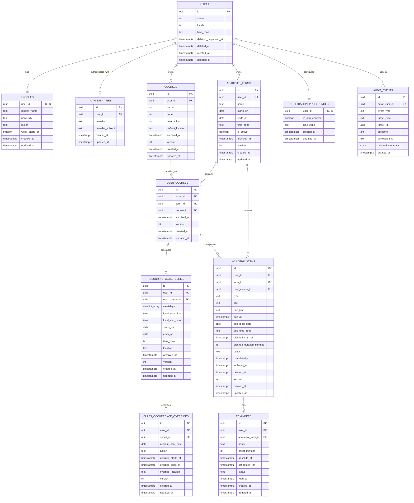

# StuPilot — Database and Domain Model

**Deliverable:** 3F  
**Version:** 1.0  
**Date:** 5 August 2026  
**Status:** Logical PostgreSQL model; no database or migration files created

## 1. Modeling decisions

1. PostgreSQL is the system of record.
2. IDs use PostgreSQL `uuid`; the exact UUID generation strategy is selected in Sprint 0. IDs are opaque and are never authorization.
3. Every owned aggregate stores `user_id`; composite keys/FKs prevent cross-owner parent linkage.
4. All rows use `created_at` and `updated_at` as `timestamptz`; mutable aggregates use a `version` integer for optimistic concurrency where appropriate.
5. Instants are stored as `timestamptz`; recurring class intent is stored as local dates/times plus an IANA time zone.
6. Assignments, projects, and exams share `academic_items` with a constrained `type`.
7. Archive is a product state; soft deletion is a retention mechanism; hard deletion is a scheduled privacy operation.
8. No file, GPA, flashcard, study-session, payment, SIS/LMS, or AI data tables belong to the MVP.

## 2. Why one `academic_items` table

Assignments, projects, and exams share ownership, term/course association, title, deadline, planned work, completion, reminders, archive/delete behavior, and Today/Week/calendar queries. Separate tables would duplicate authorization, indexes, reminders, and projections.

**Recommendation:** one table with `type IN ('ASSIGNMENT','PROJECT','EXAM')`. Avoid a generic JSON column for arbitrary type-specific data in the MVP. If a later feature proves materially different attributes, add a one-to-one extension table such as `exam_details`; split the aggregate only if lifecycle and queries diverge, not merely because labels differ.

## 3. ERD



## 4. Table specifications

### 4.1 `users`

Internal account anchor independent of auth vendor.

| Column | Type | Null | Rule |
|---|---|---:|---|
| `id` | `uuid` | No | PK, server-generated |
| `status` | text/enum | No | `ACTIVE`, `SUSPENDED`, `DELETION_PENDING`, `DELETED` |
| `locale` | text | No | MVP: `ar`, `en`; default chosen by product policy |
| `time_zone` | text | No | Valid IANA identifier |
| `deletion_requested_at` | `timestamptz` | Yes | Account deletion workflow |
| `deleted_at` | `timestamptz` | Yes | Tombstone only if policy requires it |
| timestamps | `timestamptz` | No | UTC instants |

Unique `(id, user_id)` is not applicable because this is the owner root. User email is not a domain key. If a verified email snapshot is operationally necessary, classify and retain it explicitly rather than duplicating it casually.

### 4.2 `profiles`

One-to-one, `user_id` PK/FK → users with cascade on final hard deletion.

- `display_name` optional and length-limited.
- `university` and `major` optional, user-supplied, unverified, clearable.
- `week_starts_on` optional small integer `0..6`; null means locale default.
- Do not normalize university/major into institutional tables in MVP.

### 4.3 `auth_identities`

Used for managed provider mappings or multiple auth methods.

| Column | Rule |
|---|---|
| `id` | UUID PK |
| `user_id` | FK users; cascade on final deletion |
| `provider` | Stable adapter key, not display label |
| `provider_subject` | Exact immutable provider subject |

Constraints:

- unique `(provider, provider_subject)`;
- unique `(user_id, provider, provider_subject)`;
- never auto-link accounts on email alone without a verified safe linking flow.

If authentication is application-owned, the library's account/session/verification tables are documented and migrated separately. Raw session/reset/verification tokens are never stored; only secure hashes where the library model requires application storage.

### 4.4 `academic_terms`

- FK `user_id` → users.
- `CHECK (ends_on >= starts_on)`.
- partial unique index: one active non-archived term per user.
- unique `(id, user_id)` supports composite ownership FKs.
- archive keeps children visible in historical context but removes the term from default active selection.
- hard delete cascades only during final account purge or an explicitly safe empty-term deletion; otherwise archive.

### 4.5 `courses`

User-owned course identity that can be reused in different terms through `user_courses`.

- `name` required and trimmed; duplicates allowed.
- `code`, `color_token`, `default_location` optional and length-limited.
- unique `(id, user_id)` for ownership-safe joins.
- archive hides from new enrollment creation but preserves historical enrollments.

### 4.6 `user_courses`

Enrollment/term association.

- FKs `(term_id, user_id)` → `academic_terms(id,user_id)`.
- FKs `(course_id, user_id)` → `courses(id,user_id)`.
- unique `(user_id, term_id, course_id)`.
- unique `(id, user_id)` and `(id, user_id, term_id)` for child ownership and same-term constraints.
- `ON DELETE RESTRICT` for ordinary term/course deletion; archive is preferred. Final account purge cascades from user through an explicit purge transaction or schema path.

### 4.7 `recurring_class_series`

Representation is deliberately narrower than iCalendar RRULE:

- `weekdays smallint[]`: one or more unique values `0..6` under one documented convention.
- `local_start_time`, `local_end_time`: PostgreSQL `time without time zone`; `CHECK end > start` for same-day MVP classes.
- `starts_on`, `ends_on`: inclusive local dates; check order.
- `time_zone`: IANA zone controlling local-to-instant conversion and DST.
- optional `location`, archive timestamp, version.

The application expands occurrences only for a bounded requested date range. It does not insert one row per future occurrence. Overnight classes and arbitrary monthly recurrence are outside MVP unless separately approved.

### 4.8 `class_occurrence_overrides`

Targets the occurrence identified by the series plus its **original local date**, so a moved occurrence remains traceable.

- `action`: `MODIFIED` or `CANCELLED`.
- unique `(series_id, original_local_date)`.
- composite FK `(series_id,user_id)` → series.
- modified action requires start/end instants with end after start.
- cancelled action requires override instants null.
- location may override/clear according to an explicit sentinel/null policy chosen in implementation.

Editing the whole series mutates the series; editing one occurrence upserts this table. Overrides are never interpreted as independent recurring series.

### 4.9 `academic_items`

| Field group | Rules |
|---|---|
| Ownership | `user_id`, `term_id`, optional `user_course_id`; composite FK `(user_course_id,user_id,term_id)` guarantees same owner and term |
| Identity | UUID PK; `type` constrained to assignment/project/exam |
| Content | `title` required, length-limited; no long notes/files in MVP |
| Deadline | `due_kind` is `TIMED` or `ALL_DAY` |
| Timed due | `due_at` and `due_time_zone` required; `due_local_date` null |
| All-day due | `due_local_date` and `due_time_zone` required; `due_at` null |
| Planned work | `planned_start_at` optional; duration optional positive bounded integer |
| Status | `OPEN` or `COMPLETED`; `completed_at` present exactly when completed |
| Lifecycle | `archived_at`, `deleted_at`, `version` |

Critical invariant: reschedule commands can update only `planned_start_at` and `planned_duration_minutes`. Deadline edit is a different command and audit event where required.

Uncategorized items have `user_course_id = NULL` but always belong to a term. A deleted/archived course enrollment does not delete academic items.

### 4.10 `reminders`

The MVP permits at most one active reminder per academic item unless the owner expands it.

- composite FK `(academic_item_id,user_id)` → items;
- `basis`: `DUE`, `PLANNED`, or `ABSOLUTE`;
- for `DUE`/`PLANNED`, `offset_minutes` is required and `absolute_at` null;
- for `ABSOLUTE`, `absolute_at` required and offset null;
- `scheduled_for` is the canonical computed instant used for queries and is recomputed transactionally when the basis changes;
- `status`: `ACTIVE`, `DISABLED`, `ACKNOWLEDGED`, `CANCELLED`;
- `read_at` records in-app acknowledgement where the reminder doubles as notification.

Use a partial unique index for one active/non-cancelled reminder per item if this MVP limit is adopted. Scheduled retries must use the reminder ID plus effective scheduled instant as an idempotency key.

### 4.11 `notification_preferences`

One-to-one with user. `in_app_enabled` and a time-zone snapshot are sufficient for MVP. Quiet hours, email, push, SMS, device tokens, and marketing consent are not added until those channels exist.

### 4.12 `audit_events`

Append-only application security/audit events. `actor_user_id` may be null for system or after deletion, with an appropriate FK deletion behavior (`SET NULL`). `minimal_metadata` is allow-listed JSON; it must not contain item titles, university/major, email, tokens, or request bodies.

Audit events are not a general event-sourcing system and do not rebuild domain state.

## 5. Constraints and ownership pattern

Each parent referenced by an owned child exposes a unique composite key `(id,user_id)`. Child FKs include the same user ID. This prevents a bug from connecting user A's item to user B's term even if application validation is missed.

Examples at the logical level:

```text
academic_terms UNIQUE (id, user_id)
user_courses FOREIGN KEY (term_id, user_id)
             REFERENCES academic_terms (id, user_id)
academic_items FOREIGN KEY (user_course_id, user_id, term_id)
               REFERENCES user_courses (id, user_id, term_id)
```

Repository methods still scope every query by `user_id`; database constraints do not replace read authorization.

## 6. Baseline indexes

Indexes are reviewed with real query plans, but the starting set is:

| Table | Index | Purpose |
|---|---|---|
| auth identities | unique provider + subject | Login mapping |
| terms | `(user_id, archived_at, starts_on, ends_on)` | Active/history lists |
| terms | partial unique `(user_id)` where active and not archived | Single active term |
| user courses | `(user_id, term_id, archived_at)` | Term course picker |
| series | `(user_id, user_course_id, starts_on, ends_on)` | Bounded occurrence expansion |
| overrides | unique `(series_id, original_local_date)` | Occurrence lookup/upsert |
| overrides | `(user_id, original_local_date)` | Owner calendar range |
| items | `(user_id, term_id, status, due_at)` partial for timed/non-deleted | Today/Week due query |
| items | `(user_id, term_id, status, due_local_date)` partial for all-day/non-deleted | All-day due query |
| items | `(user_id, planned_start_at)` partial where planned and non-deleted | Planned views |
| items | `(user_id, user_course_id, status)` | Course detail |
| reminders | `(user_id, status, scheduled_for)` | Due notification lookup |
| audit | `(actor_user_id, created_at desc)` | Security review |

Avoid indexes on every column. Verify selectivity, write overhead, and `EXPLAIN` output during implementation.

## 7. Time-zone rules

- `users.time_zone` controls default display and planning interpretation.
- `academic_terms.time_zone` snapshots term context.
- `recurring_class_series.time_zone` preserves intended local class time across DST.
- A timed item stores the actual due instant plus the zone used for future display/edit interpretation.
- An all-day deadline stores a local `date`; it must not be converted to midnight UTC.
- Planned work is an instant (`timestamptz`) displayed in the current user zone.
- Week calculations use user time zone plus approved week-start preference.
- Tests cover forward/back DST transitions, zone changes, dates around midnight, and Arabic/English formatting.

## 8. Archive and deletion behavior

| Object | Normal user action | Effect |
|---|---|---|
| Term | Archive | Hidden from active defaults; descendants retained |
| Course | Archive | Hidden from new picks; enrollments/history retained |
| User course | Archive/remove from term | Series disabled/archived; items retained under term and may become uncategorized by explicit policy |
| Class series | Archive/cancel | Future generated occurrences hidden; overrides retained for history until purge |
| Academic item | Archive or soft delete | Hidden from normal views; recoverable during grace if policy allows |
| Reminder | Disable/delete | No due notification; no item mutation |
| Account | Deletion workflow | Reauthenticate, grace if approved, revoke access, purge owned data/provider identity according to policy |

Database cascades are permitted for final, deliberate account purge but not exposed as an unreviewed ordinary UI delete. Large cascades are job-managed and observable.

## 9. Proposed retention baseline

Final periods require owner/legal approval before production.

| Data | Proposed handling |
|---|---|
| Active academic data | Retain while account is active or until user deletes it |
| Soft-deleted item | 30-day recovery then purge (proposal) |
| Account deletion | 14-day cancellation grace then purge (proposal) |
| Auth sessions/tokens | Provider/library security lifetime; revoke on deletion/reset |
| Verification/reset token | Expire quickly; purge/hash according to auth model |
| Security audit | 12 months with minimal metadata (proposal) |
| Application logs | 30–90 days, redacted (proposal) |
| Backups | Provider retention; deleted data ages out and restore procedure reapplies deletion ledger |

No data is retained “forever” by default. Legal hold is not implemented without a real legal requirement and access process.

## 10. Migrations and seed data

- Prisma schema and SQL migration history become version-controlled only in Sprint 0/1 after authorization.
- Migration files are immutable after production application; correction uses a new migration.
- CI tests empty install and upgrade path.
- Synthetic seed data uses fictional universities/courses and no participant/research data.
- Production has no automatic demo seed.
- Data backfills are idempotent, observable, bounded, and separately deployable for large changes.

## 11. Query projections

Today/This Week/calendar are application queries combining:

- bounded series expansion + occurrence overrides;
- timed and all-day academic deadlines;
- planned work instants;
- completion/archive/delete state;
- active term and filters.

Do not create denormalized projection tables for MVP. Add materialized projections only after measured query or scale evidence and with a rebuild strategy.

## 12. Deferred tables

The following are architecture notes only and must not be created during MVP:

- `files` / object metadata;
- `notes`;
- `grades` / `gpa_periods`;
- `study_sessions` / `flashcards`;
- `ai_requests` / `ai_outputs`;
- outbound `notification_deliveries`, device tokens, durable job/outbox tables until external delivery exists;
- organizations, university catalogs, SIS/LMS connections, payments, subscriptions, sharing, community.

## 13. Database acceptance criteria

- All minimum domains are represented and owned.
- Same-user composite foreign keys prevent cross-owner linkage.
- Exactly one active term constraint is enforceable.
- Deadline and planned work are separate columns/commands.
- One-occurrence changes are overrides, not series mutation.
- Recurrence preserves local time with IANA zone.
- Today/Week query paths have baseline indexes.
- Archive, soft delete, hard delete, backup aging, and retention are distinguishable.
- Auth provider can change without rewriting domain foreign keys.
- ERD contains no out-of-scope production domain.
